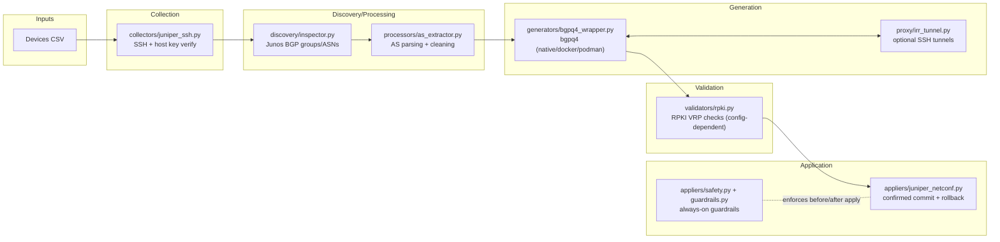
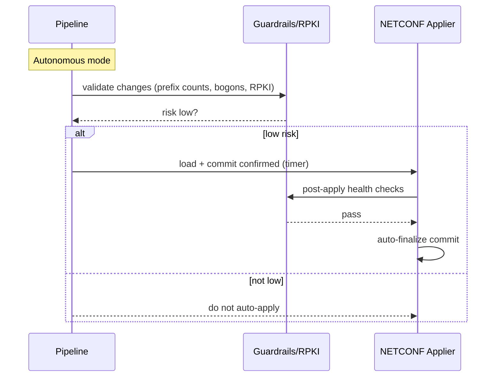

# Otto BGP v0.3.2 Executive Summary

## Overview

Otto BGP discovers BGP context from Juniper routers over SSH, extracts AS numbers, generates router‑aware Junos `policy-options` prefix‑lists using bgpq4 (with optional IRR proxy tunneling), and can apply changes via NETCONF with always‑on safety guardrails. Email notifications for NETCONF events are supported when configured.

## Architecture

## Operation Modes

- System mode: runs on demand, generates policies, and uses NETCONF with confirmed commits; final confirmation is manual.
- Autonomous mode: scheduled via systemd timer; generates and applies low‑risk changes after guardrails and post‑apply health checks; auto‑finalizes only when checks pass. Email notifications are sent if configured.

## Security Posture

- SSH host keys: strict verification via `utils/ssh_security.py` with managed `known_hosts` (setup mode supported for first use).
- Least privilege: systemd units run as `otto-bgp` user with fs/network restrictions (see `systemd/*.service`).
- Input hardening: AS number range checks, filename/path sanitization, subprocess argument validation.
- Timeouts and isolation: bounded SSH/command timeouts, parallel worker monitoring in generators/validators.
- Optional RPKI: VRP cache validation with fail‑closed design and allowlist support when configured.
- Auditability: structured logging; NETCONF connect/preview/apply/confirm/rollback notifications via email when enabled.

## Risk Assessment

- Change scope: generates Junos `policy-options` prefix‑lists; does not alter unrelated router config.
- Pre‑apply guardrails: prefix‑count thresholds, bogon detection, concurrency/signal safety; RPKI checks when configured.
- Rollback safety: confirmed commit with automatic rollback if not confirmed; autonomous mode auto‑confirms only after health checks pass.
- Dependencies and integrity: relies on IRR data via bgpq4 and (optionally) RPKI VRPs; proxy tunnels available where IRR is restricted.
- Notifications: email relies on correct SMTP configuration; recommended when using autonomous mode.

## Known Gaps and Limitations

- Juniper only: collection and NETCONF application target Junos via PyEZ; other vendors are out of scope.
- RPKI is config‑dependent: validation runs only when VRP cache paths and settings are provided; fail‑closed is recommended for autonomous use.
- IPv6 prefix accounting: guardrail prefix counters match IPv4 patterns and may under‑count IPv6 in risk calculations; policy generation via bgpq4 can produce IPv6, but counters should be reviewed before IPv6‑heavy use.
- IRR availability: bgpq4 requires IRR access; the SSH tunnel proxy is optional and depends on reachable jump hosts and credentials.
- Notification dependency: autonomous email notifications require `autonomous_mode.notifications.email.enabled=true`; autonomous operation does not depend on email, but lack of notifications reduces audit visibility.
