# Otto BGP v0.3.2 Executive Summary

## Overview

Otto BGP discovers BGP context from Juniper routers over SSH, extracts AS numbers, generates router-aware Junos `policy-options` prefix-lists using bgpq4 (with optional IRR proxy tunneling), and applies changes via NETCONF with always-on safety guardrails. Email notifications for NETCONF events are configurable.

## Architecture

Otto BGP implements a sophisticated **router-aware pipeline** that maintains device identity throughout all processing stages. The system processes multiple routers in parallel while preserving individual router context, generating per-router policies with comprehensive safety validation.

**Key Architectural Features:**
- **Router Identity Preservation**: Each router maintains its `RouterProfile` from collection through policy generation
- **Parallel Processing**: Multiple devices processed simultaneously with individual error handling
- **Layered Safety**: Always-active guardrails plus optional RPKI validation based on operation mode
- **Flexible Deployment**: Supports both native and containerized bgpq4, with optional IRR proxy tunneling

### High-Level Overview

```mermaid
graph LR
  DEVICES["📄 Device List"] --> COLLECT["🔗 Collect"]
  COLLECT --> DISCOVER["🔍 Discover"] 
  DISCOVER --> GENERATE["⚙️ Generate"]
  GENERATE --> VALIDATE["🛡️ Validate"]
  VALIDATE --> APPLY["📤 Apply"]
  
  VALIDATE -.->|"Autonomous: Low risk only<br/>System: Manual confirm"| APPLY
  
  style DEVICES fill:#e1f5fe
  style COLLECT fill:#f3e5f5
  style DISCOVER fill:#f3e5f5
  style GENERATE fill:#f3e5f5
  style VALIDATE fill:#ffecb3
  style APPLY fill:#e8f5e8
```

### Detailed Architecture Flow

```mermaid
flowchart TB
  %% Input Layer
  CSV["📄 Devices CSV<br/>hostname,ip,role<br/>(×N routers)"]
  
  %% Processing Layer - Organized by Function
  subgraph COLLECT["🔗 Data Collection"]
    SSH["SSH Collection<br/>collectors/juniper_ssh.py<br/>Host key verification"]
  end
  
  subgraph DISCOVER["🔍 Discovery & Processing"]
    DISC["BGP Discovery<br/>discovery/inspector.py<br/>BGP groups + AS numbers"]
    AS["AS Extraction<br/>processors/as_extractor.py<br/>RFC validation"]
  end
  
  subgraph GENERATE["⚙️ Policy Generation"]
    POL["Policy Generation<br/>generators/bgpq4_wrapper.py<br/>Native/Docker/Podman"]
  end
  
  %% Safety Layer - Overlay
  subgraph SAFETY["🛡️ Safety Validation"]
    GUARD["Always-Active Guardrails<br/>Prefix count • Bogons • Concurrency"]
    RPKI["RPKI Validation<br/>Optional (system) • Required (autonomous)"]
  end
  
  %% Output Layer
  subgraph OUTPUT["📤 Application & Output"]
    NET["NETCONF Application<br/>Confirmed commits + rollback"]
    FILES["Per-Router Policies<br/>policies/router-name/"]
    MATRIX["Deployment Matrix<br/>Cross-router relationships"]
  end
  
  %% External Dependencies
  subgraph EXTERNAL["🌐 External Systems"]
    IRR["Internet Routing Registries<br/>WHOIS (43) • HTTPS (443)"]
    PROXY["SSH Tunnel Proxy<br/>(optional)"]
  end
  
  %% Main Data Flow
  CSV ==> COLLECT
  COLLECT ==> DISCOVER
  DISCOVER ==> GENERATE
  
  %% Safety Validation
  GENERATE ==> SAFETY
  SAFETY ==> OUTPUT
  
  %% External Dependencies
  GENERATE -.->|bgpq4 queries| IRR
  GENERATE -.->|optional proxy| PROXY
  PROXY -.->|tunneled queries| IRR
  
  %% Router-Specific Outputs
  COLLECT -.->|per-router identity| FILES
  DISCOVER -.->|router relationships| MATRIX
  
  %% Styling
  classDef inputNode fill:#e1f5fe,stroke:#0277bd,stroke-width:2px
  classDef processNode fill:#f3e5f5,stroke:#7b1fa2,stroke-width:2px
  classDef safetyNode fill:#ffecb3,stroke:#f57c00,stroke-width:2px
  classDef outputNode fill:#e8f5e8,stroke:#2e7d32,stroke-width:2px
  classDef externalNode fill:#fce4ec,stroke:#c2185b,stroke-width:2px
  
  class CSV inputNode
  class COLLECT,DISCOVER,GENERATE processNode
  class SAFETY safetyNode
  class OUTPUT outputNode
  class EXTERNAL externalNode
```

## Operation Modes

**System Mode** (Interactive):
- On-demand execution with manual confirmation
- NETCONF operations require explicit user confirmation
- 25% maximum prefix count change threshold
- RPKI validation optional
- Concurrent operations allowed

**Autonomous Mode** (Scheduled):
- Scheduled execution via systemd timer
- Automatic policy application with stricter safety thresholds
- 10% maximum prefix count change threshold
- RPKI validation required when configured
- No concurrent operations allowed
- Auto-confirmation only after health checks pass

### Operation Mode Decision Flow

```mermaid
flowchart TD
  START["Otto BGP Execution<br/>🚀 Pipeline Start"]
  
  MODE{"Operation Mode<br/>Detection"}
  
  subgraph "System Mode Path"
    SYS_GUARD["Guardrail Validation<br/>🛡️ 25% threshold<br/>⚠️ RPKI optional"]
    SYS_RISK{"Risk Assessment"}
    SYS_APPLY["NETCONF Apply<br/>⏸️ Manual confirmation required"]
    SYS_CONFIRM["User Confirmation<br/>👤 Interactive prompt"]
    SYS_COMMIT["Confirmed Commit<br/>✅ Manual finalization"]
  end
  
  subgraph "Autonomous Mode Path"  
    AUTO_GUARD["Guardrail Validation<br/>🛡️ 10% threshold<br/>🔒 RPKI required"]
    AUTO_RISK{"Risk Assessment"}
    AUTO_APPLY["NETCONF Apply<br/>⏱️ Confirmed commit (timer)"]
    AUTO_HEALTH["Health Check<br/>🔍 Post-apply validation"]
    AUTO_COMMIT["Auto-finalize<br/>✅ Automatic completion"]
    AUTO_EMAIL["Email Notification<br/>📧 Operation report"]
  end
  
  BLOCK["🛑 BLOCKED<br/>Critical risk detected<br/>Operation terminated"]
  
  START --> MODE
  MODE -->|ENV: OTTO_BGP_MODE=system| SYS_GUARD
  MODE -->|ENV: OTTO_BGP_MODE=autonomous| AUTO_GUARD
  
  SYS_GUARD --> SYS_RISK
  SYS_RISK -->|Low/Medium/High| SYS_APPLY
  SYS_RISK -->|Critical| BLOCK
  SYS_APPLY --> SYS_CONFIRM
  SYS_CONFIRM -->|Yes| SYS_COMMIT
  SYS_CONFIRM -->|No/Timeout| BLOCK
  
  AUTO_GUARD --> AUTO_RISK  
  AUTO_RISK -->|Low only| AUTO_APPLY
  AUTO_RISK -->|Medium/High/Critical| BLOCK
  AUTO_APPLY --> AUTO_HEALTH
  AUTO_HEALTH -->|Pass| AUTO_COMMIT
  AUTO_HEALTH -->|Fail| BLOCK
  AUTO_COMMIT --> AUTO_EMAIL
```

## Security Posture

**Network Security:**
- SSH host key strict verification with managed `known_hosts` database
- NETCONF connections with confirmed commits and automatic rollback
- Optional SSH tunnel proxy for IRR queries in restricted environments

**System Hardening:**
- SystemD services run as dedicated `otto-bgp` user with minimal privileges
- Filesystem restrictions: read-only access to configuration, limited write access to output directories
- Network restrictions: private network access only (10.0.0.0/8, 172.16.0.0/12, 192.168.0.0/16)
- Resource limits: 1GB memory, 25% CPU quota, 50 process limit

**Input Validation:**
- AS number validation against RFC 4893 range (0-4294967295)
- Policy name sanitization to prevent command injection
- Subprocess execution with argument validation
- Timeout enforcement on all network operations

**RPKI Validation:**
- Tri-state validation logic (VALID/INVALID/NOTFOUND)
- VRP cache processing with fail-closed behavior
- Allowlist support for known-good prefixes
- Offline validation capabilities

### Always-Active Guardrail System

```mermaid
flowchart TB
  subgraph "Policy Context Input"
    CTX["Policy Context<br/>• AS numbers<br/>• Prefix lists<br/>• Router profiles<br/>• Operation mode"]
  end

  subgraph "Guardrail Components (Always Active)"
    PC["Prefix Count Guardrail<br/>🔢 Max change thresholds<br/>System: 25% | Autonomous: 10%"]
    BOGON["Bogon Prefix Guardrail<br/>🚫 RFC-defined invalid ranges<br/>0.0.0.0/8, 10.0.0.0/8, etc."]
    CONC["Concurrent Operation Guardrail<br/>🔒 Lock file management<br/>Prevents overlapping runs"]
    SIG["Signal Handling Guardrail<br/>⚡ Graceful shutdown<br/>SIGTERM/SIGINT handling"]
  end

  subgraph "Risk Assessment Engine"
    RISK["Risk Level Aggregation<br/>🛡️ LOW | MEDIUM | HIGH | CRITICAL"]
  end

  subgraph "Safety Decision"
    SYS_OK["System Mode<br/>✅ Proceed with warnings<br/>Manual confirmation required"]
    AUTO_OK["Autonomous Mode<br/>✅ Auto-proceed<br/>Low risk only"]
    BLOCK["Any Mode<br/>🛑 BLOCKED<br/>Critical risk detected"]
  end

  CTX --> PC & BOGON & CONC & SIG
  PC --> RISK
  BOGON --> RISK
  CONC --> RISK
  SIG --> RISK
  
  RISK -->|Critical Risk| BLOCK
  RISK -->|System Mode<br/>Med/High Risk| SYS_OK
  RISK -->|Autonomous Mode<br/>Med/High Risk| BLOCK
  RISK -->|Low Risk| AUTO_OK
  RISK -->|Low Risk| SYS_OK
```

## Risk Assessment

**Configuration Scope:**
- Modifies only Junos `policy-options` prefix-lists
- Does not alter BGP protocol configuration, interfaces, or routing policy logic
- Changes are isolated to prefix-list definitions within policy-options stanza

**Safety Mechanisms:**
- **Always-active guardrails:** Cannot be disabled in production
  - Prefix count threshold monitoring (10% autonomous, 25% system mode)
  - Bogon prefix detection using RFC-defined ranges
  - Concurrent operation prevention with lock files
  - Signal handling for graceful shutdown
- **NETCONF safety:** Confirmed commits with automatic rollback timers
- **RPKI validation:** Optional in system mode, configurable requirement in autonomous mode

**External Dependencies:**
- **IRR data availability:** bgpq4 requires access to Internet Routing Registries
- **RPKI data freshness:** VRP cache staleness triggers fail-closed behavior
- **SSH connectivity:** Host key verification requires initial setup
- **SystemD integration:** Autonomous mode requires proper timer configuration

### Deployment Architecture

**Operational Risks:**
- **IPv6 prefix handling:** Guardrail counters optimized for IPv4 patterns
- **Large AS sets:** Memory usage scales with AS set size and bgpq4 output
- **Network partitions:** IRR or RPKI unavailability impacts policy generation

## Known Gaps and Limitations

**Platform Limitations:**
- **Juniper-only implementation:** Collection via SSH and NETCONF application target Junos exclusively; other network vendors (Cisco, Arista, etc.) are not supported
- **Python 3.10+ requirement:** Uses modern Python features not available in older distributions

**RPKI Implementation Gaps:**
- **Configuration-dependent validation:** RPKI checks only run when VRP cache paths and settings are provided in configuration
- **Cache staleness handling:** Fail-closed behavior when VRP data exceeds configured age threshold may block legitimate operations
- **Limited VRP sources:** Currently supports rpki-client and routinator JSON formats; other RPKI validators require format conversion

**IPv6 Support Limitations:**
- **Prefix counting accuracy:** Guardrail prefix counters use IPv4-optimized patterns that may undercount IPv6 prefixes in risk calculations
- **Policy generation scope:** While bgpq4 can generate IPv6 policies, guardrail thresholds should be reviewed for IPv6-heavy environments

**Operational Dependencies:**
- **IRR availability requirements:** bgpq4 requires Internet Routing Registry access; network partitions impact policy generation
- **SSH tunnel proxy limitations:** IRR proxy functionality depends on reachable jump hosts and properly configured SSH keys
- **SystemD integration:** Autonomous mode requires systemd; not compatible with other init systems
- **Host key management:** Initial SSH host key collection requires manual setup process before production use

**Monitoring and Alerting:**
- **Email notification dependency:** Autonomous mode email notifications require proper SMTP configuration; silent failures reduce operational visibility
- **Limited metrics export:** No integration with monitoring systems like Prometheus or SNMP
- **Log aggregation:** Structured logging exists but requires external log management for centralized monitoring

**Scalability Considerations:**
- **Memory usage with large AS sets:** Memory consumption scales linearly with AS set size and bgpq4 output volume
- **Sequential processing:** Router processing is sequential; no parallel SSH collection across multiple devices
- **Lock file cleanup:** Stale operation locks require manual cleanup if processes terminate unexpectedly
